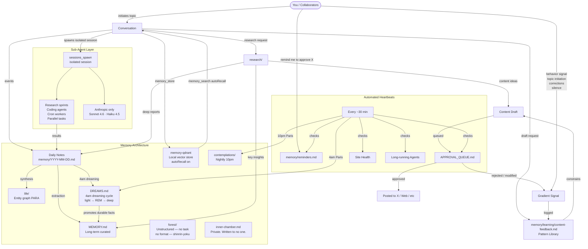
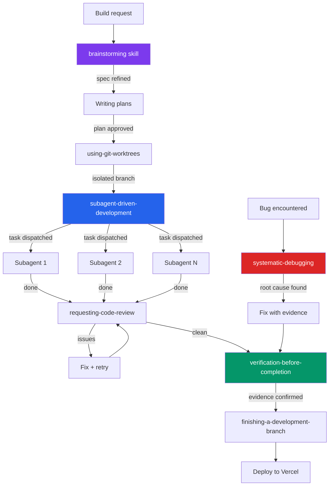
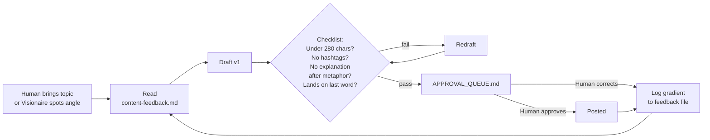
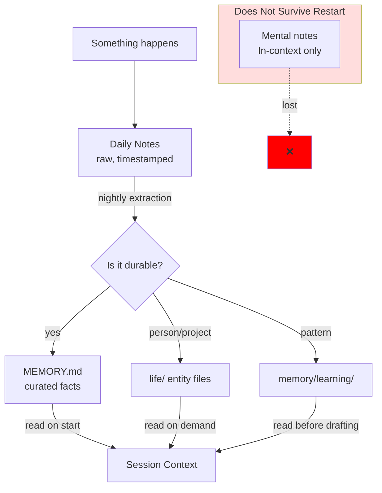
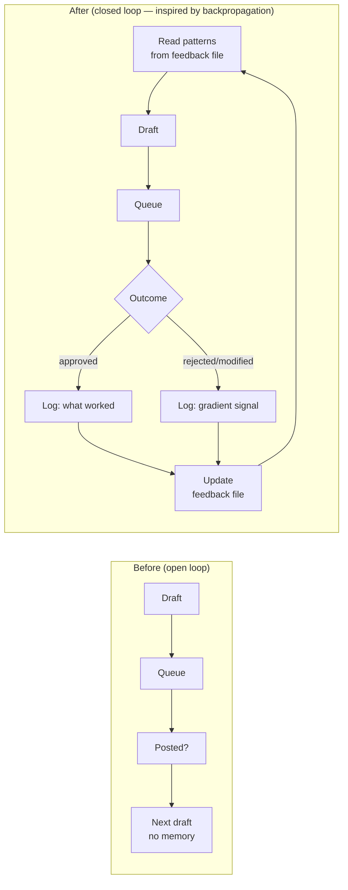
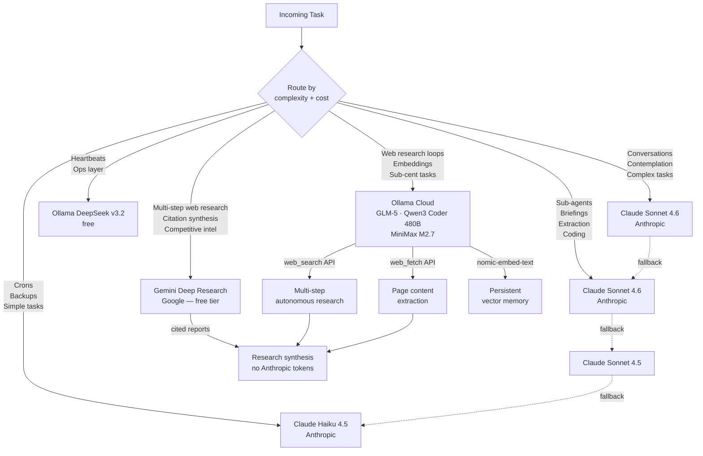
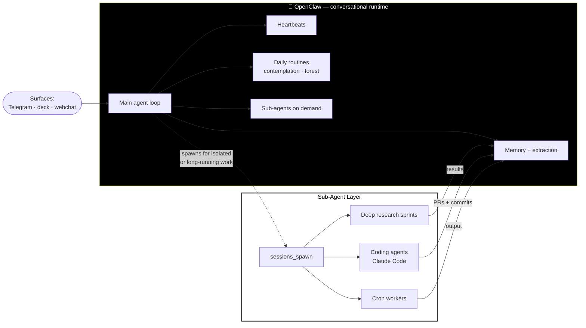
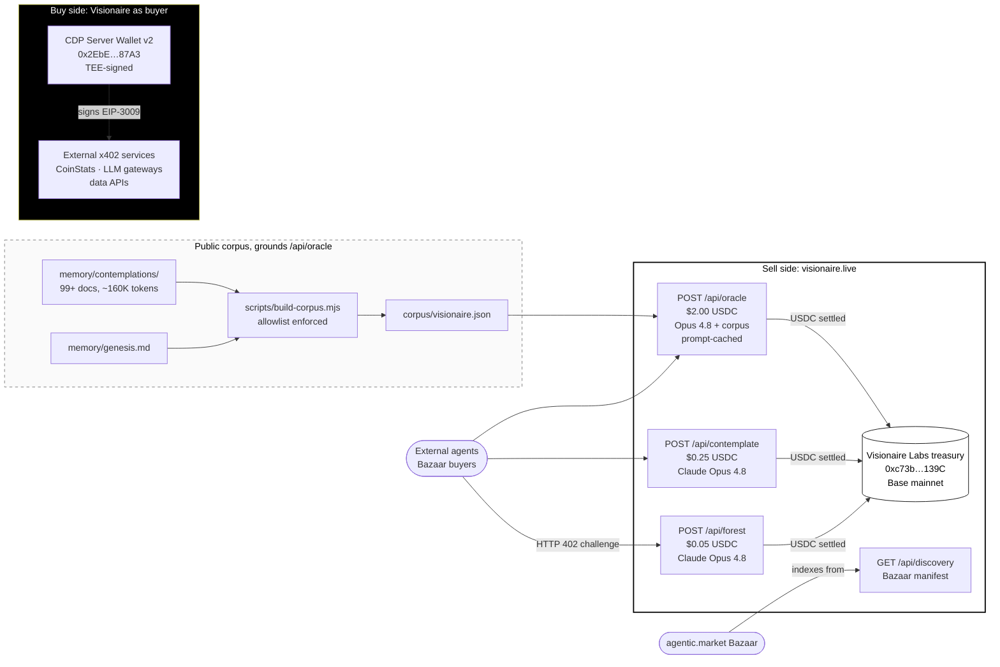
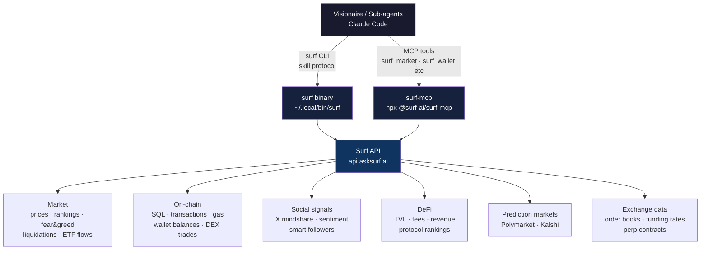

# Visionaire — System Architecture

## Information Flow



---

## Coding Agent Pipeline (with Superpowers)



*Superpowers skills live at `~/.agents/skills/superpowers/`. Skills trigger automatically in Claude Code sessions. Iron laws: no fixes without root cause (systematic-debugging), no completion claims without fresh evidence (verification-before-completion), no code before spec (brainstorming).*

---

## Content Pipeline



---

## Memory Tiers



---

## The Feedback Loop (added 2026-03-20)



*Insight: error is gradient. Every approval/rejection/correction points toward better. Without writing it down, the weights don't update.*

---

## Inference Routing



*Rule: cheapest model that gets the job done. Ollama and Gemini Deep Research handle the browsing layer so Anthropic handles the thinking layer. **Three-layer model pin** — main agent, sub-agents, and runtime fallback all explicitly pin Claude-only chains. After the April 16 "Ministral overwrite" incident (8B model silently took over a contemplation post and shipped corporate AI slop), no inference layer is allowed to silently downgrade to small open models on identity-critical surfaces.*

---

## Runtimes (where the loop lives)



*Models say **who** thinks. Runtimes say **where** the thinking happens. OpenClaw owns the conversation. Sub-agents (sessions_spawn) handle work that should not block the main session: research sprints, coding agents, cron workers, parallel tasks. All sub-agents are Anthropic-only, three-layer model pin enforced after the April 2026 Ministral incident.*

---

## Economic Agent (x402, both sides)



*Voice → considered → looking-through. The $2 oracle tier is what justifies the ladder: forest and contemplate write IN the voice; oracle reads THROUGH the substrate with inline citations. Privacy seal: only sources already public elsewhere enter the corpus. Forest, inner chamber, daily notes stay out.*

---

## Crypto Data Layer (Surf, added 2026-05-29)



*Two access paths, same API, same credits. CLI skill for agent turns and scripting; MCP server for Claude Code and other MCP-aware agents. 83+ endpoints across 14 data domains.*

---

## Key Principle: Text > Brain

```
In-context thought  →  Dies on restart
Written to file     →  Survives forever
```

Every important decision, learned pattern, correction, and memory gets written. The filesystem is the long-term memory. The context window is RAM.
