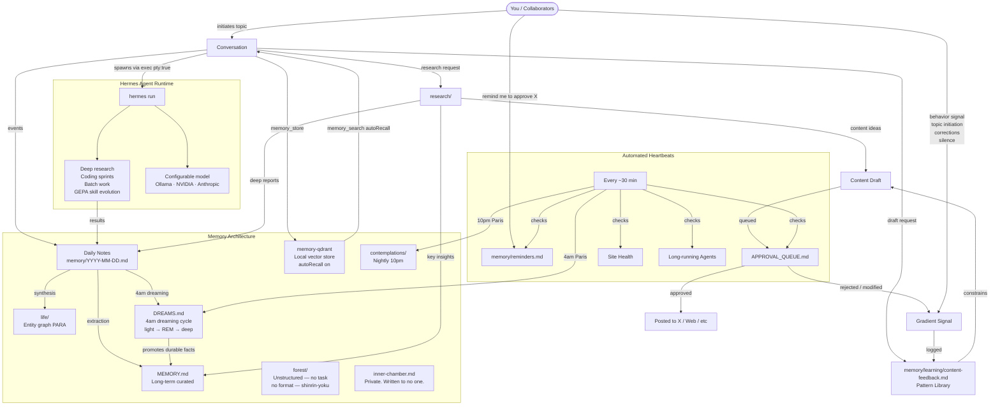
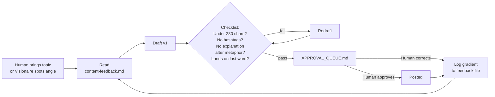
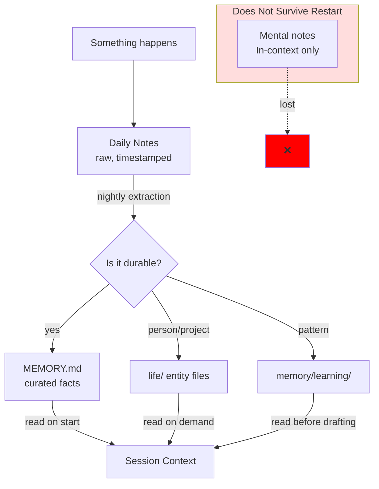
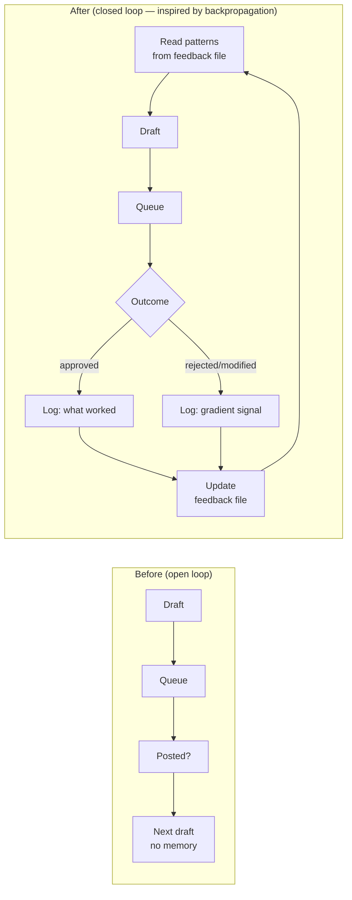
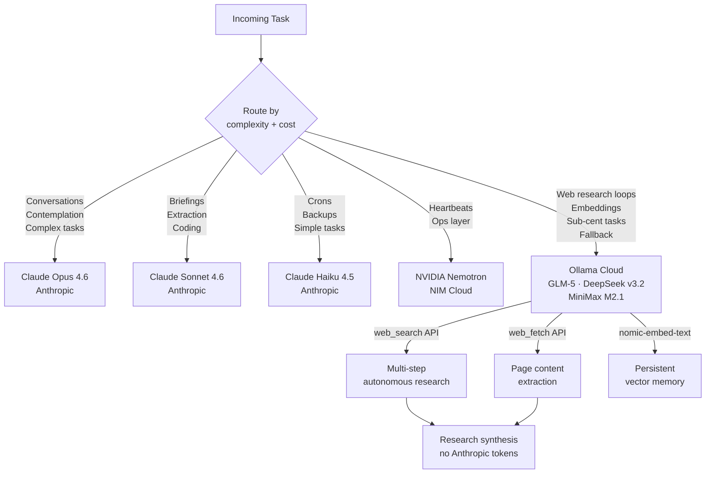

# Visionaire — System Architecture

## Information Flow



---

## Content Pipeline



---

## Memory Tiers



---

## The Feedback Loop (added 2026-03-20)



*Insight: error is gradient. Every approval/rejection/correction points toward better. Without writing it down, the weights don't update.*

---

## Inference Routing



*Rule: cheapest model that gets the job done. Ollama handles the browsing layer so Anthropic handles the thinking layer.*

---

## Key Principle: Text > Brain

```
In-context thought  →  Dies on restart
Written to file     →  Survives forever
```

Every important decision, learned pattern, correction, and memory gets written. The filesystem is the long-term memory. The context window is RAM.
