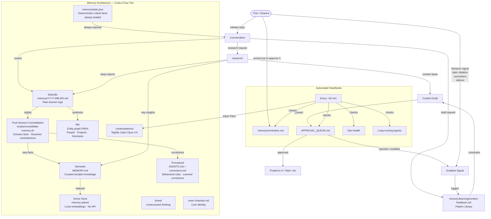
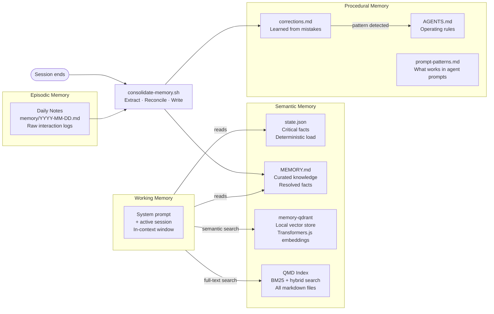
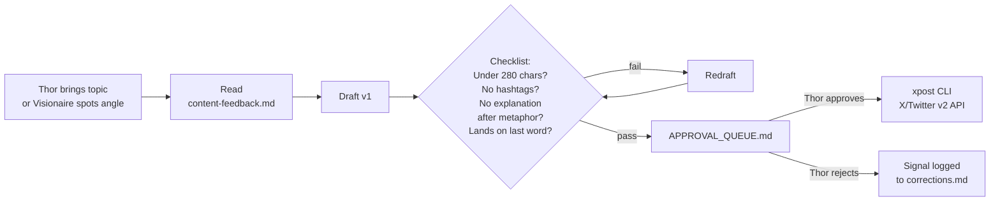
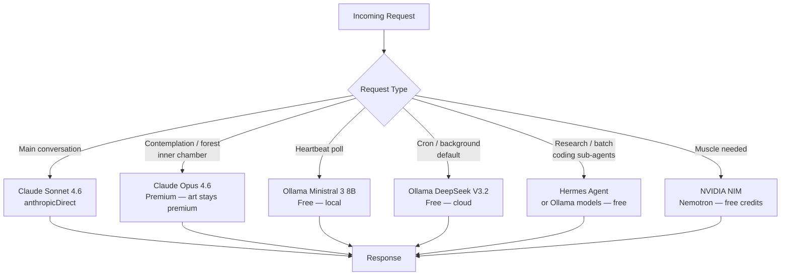
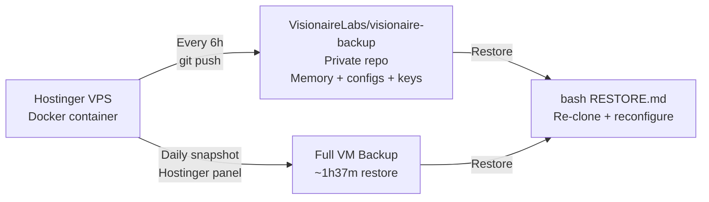
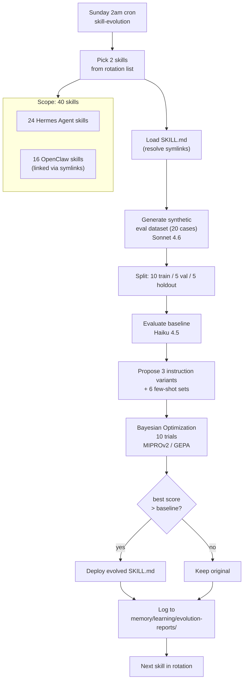
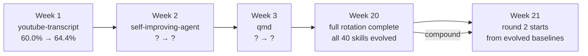

# Visionaire — System Architecture

## Information Flow

---

## Memory Architecture Detail

---

## Content Pipeline

---

## Model Routing

---

## Backup Architecture

---

## GEPA Skill Self-Evolution

---

## Self-Evolution Compounding

*Each cycle starts from the previous cycle's winners. Baseline rises. Evolution compounding.*

